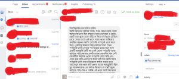
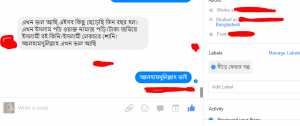
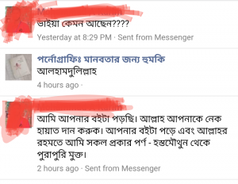
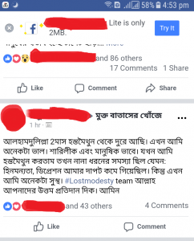

বিসমিল্লাহির রাহমানির রাহিম

এগারো

আমি আদনান।

গ্রামের সহজ, সরল ছেলে।ছোট থেকে আমার অভ্যাস ছিল বন্ধুদের সাথে খেলাধুলা ও ছোটা -ছোটি করা।স্কুল থেকে বাড়িতে ফিরে বই গুলো টেবিলে রেখে সোজা মাঠে।এই ভাবে সময় গুলো অতিক্রম করছিলাম। তখনও আমি পর্নোগ্রাফি সম্পর্কে একে বারে অজ্ঞ।একদিন আমারা কিছু ফ্রেন্ডরা মিলে প্রথম পর্নোগ্রাফি দেখি।দেখার পর আমার মাঝে ভাল লাগার একটি অনুভুতি তৈরী হয়।সেই থেকে পর্নোগ্রাফি মধ্যে জড়িয়ে পড়ি।

আমার একটা চায়না মোবাইল ছিল। সেই মোবাইলে অনেক পর্ন লোড করি এবং দেখা শুরু করি।এরপর যা হবার তাই হল।আমি যখন পর্নোগ্রাফি দেখি তখন নিজেকে কন্ট্রোল করার জন্য হস্তমৈথুন করতাম। প্রথম বারের অনুভুতিটা ছিল খুবই আনন্দদায়ক। এর ফাঁকে কীভাবে যে হস্তমৈথুনে জড়িয়ে পড়লাম টেরও পেলামনা।

নিজেকে আবিষ্কার করলাম অন্ধকারের আস্তঁকুড়ে।সব সময় জীবন নিয়ে খুব হতাশার মধ্য থাকতাম। মনে হতো আমাকে দিয়ে কিছু হবেনা।আগে অনেক কাজ করতে পারতাম। কিন্তু এখন একটু কাজ করলেই হাঁফিয়ে উঠি। চোখে কিছুটা কম দেখি। সারা দিন ঘরের কোণায়  বসে থাকি।

একদিন আমার এক ফ্রেন্ড আমাকে কিছু লেকচার দেয়েছিল শোনার জন্য। নাম পরকালের পথে যাত্রা ([https://www.raindropsmedia.org/porokal/](https://www.raindropsmedia.org/porokal/) )। লেকচার শোনার পর  নিজেকে প্রকৃত মানুষ হিসেবে চিনতে পারলাম। আল্লাহ সুবহনাহু তা'আলা কেন আমাকে সৃষ্টি করেছেন,আমার শেষ গন্তব্য কোথায়... । অবশেষে আল্লাহ সুবহনাহু তা'আলার অসীম অনুগ্রহে আমি হিদায়েতের আলো পাই । আমি এখন পাঁচ ওয়াক্ত নামাজ আদায় করি । দাঁড়িও রেখেছি আলহামদুলিল্লাহ!

ইসলামে বিধি বিধানের উপর চলার চেষ্টা করি।আগে গান, মুভি ও খেলা দেখতাম। আস্তে আস্তে সব কিছু ছেড়ে দিই।এখন ইসলাম নিয়ে জানতে ও পড়তে ভালবাসি।আলহামদুলিল্লাহ আমি অনেক দিন যাবত পর্নোগ্রাফির এই নীল জগৎ ছেড়ে মুক্ত বাতাসের শ্বাস নিচ্ছি।

আল্লাহ (সুবঃ) বলেন: ‘বলুন, হে আমার বান্দাগণ যারা নিজেদের উপর যুলুম করেছ তোমরা আল্লাহর রহমত থেকে নিরাশ হয়োওনা। নিশ্চয়ই আল্লাহ সমস্ত গুনাহ মাফ করে দেবেন।তিনি ক্ষমাশীল,পরম দয়ালু" (সূরা আয- জুমার-৫৩)

.

 

কী ছিল না এই ধ্বংসের জগৎটাতে। এর কিছু ভয়াবহ ক্ষতি নিচে তুলে ধরলাম। .

১) পর্নোগ্রাফি আপনাকে ভালবাসার বিকৃতি শেখায়। ২) পর্নোগ্রাফি আপনার মানবিক অনুভুতি নষ্ট করে ফেলে। ৩) পর্নোগ্রাফি আপনার স্বরণ শক্তি কমায়,আপনার মধ্যে ডিপ্রেশন তৈরি করে। ৪) পর্নোগ্রাফি আপনাকে অক্ষম করে দিতে পারে ৫) আপনি যখন পর্নোগ্রাফি দেখেন আপনি পতিতা তৈরি করেন। ৬) সব কিছু আপনার আমলনামায় লিপি বদ্ধ হচ্ছে।

.

পর্নোগ্রাফি আসক্তি থেকে মুক্তির উপায়ঃ- .

১) ডিজিটাল মিড়িয়ার কোন মেয়ের দিকে তাকাবেন না। ২) দৃষ্টি নামিয়ে চলাফেরা করার চেষ্টা করুন। ৩) খারাপ ফ্রেন্ডসার্কেল থেকে দূরে থাকুন। ৪) একাকী না থেকে দ্বীনী ভাইদের সাথে সময় কাটান। ৫) কিছুতেই নামাজ ছাড়বেনা। ৬) মাঝে সাঝে নফল রোজা রাখুন। ৭) আল্লাহর কাছে নিয়মিত দোয়া করুন।

শেষ কথা:

‘হে ভাই আমার মনে রাখবেন – আপনি যত পাপ করতে পারেন, আল্লাহ্ তার চেয়েও বেশি ক্ষমা করতে পারেন , কিন্তু শর্ত হলো আপনাকে চেষ্টা চালিয়ে যেতে হবে। দৃঢ় প্রতিজ্ঞাবদ্ধ হোন – আর কোনোদিন পর্ন দেখবেন না। যদি শয়তানের ফাঁদে পড়ে কখনো দেখে ফেলেন তো সাথে সাথে গোসল করে দুই রাকআত নামাজ পড়ে আল্লাহর কাছে তাওবাহ করে নিন, দেরি করবেন না। তারপর দ্বিগুন দৃঢ়তা নিয়ে আবার প্রতিজ্ঞা করুন – আর কোনদিন পর্ন দেখবেন না, আপনি আর শয়তানের দাস হবেন না, শয়তান বরং আপনার দাস হবে। কিছুতেই হাল ছাড়বেন না, কিছুতেই না, শয়তান তার শয়তানীতে হাল ছাড়েনি, আপনিও আপনার ঈমানদারীতে হাল ছাড়বেন না। শুধু গন্তব্যে পৌঁছানোই সফলতা নয়, গন্তব্যে পৌঁছানোর যাত্রাটাও সফলতা।

রাসূলুল্লাহ(সাঃ) বলেছেন,"কেউ যদি আমাকে দুটো জিনিসের নিশ্চয়তা দেয়,তাহলে আমি তাকে জান্নাতের নিশ্চয়তা দিচ্ছি। সে দুটো জিনিস হলো জিহ্বা এবং দুই রানের মাঝখানের লজ্জাস্থান" ( বুখারিঃ ৬১০৯)

আল্লাহ (সুবঃ) বলেন, ‘(জান্নাত প্রস্তুত রাখা হয়েছে তাদের জন্য) যারা কোনও অশ্লীল কাজ করে ফেললে বা নিজেদের প্রতি যুলুম করলে আল্লাহকে স্মরণ করে এবং নিজেদের পাপের জন্য ক্ষমা প্রার্থনা করে। আল্লাহ্‌ ছাড়া আর কে পাপ ক্ষমা করবে’? (সূরা আলে-ইমরান ৩:১৩৫)

.

চলবে ইনশা আল্লাহ...

         

                                                   

[নীড়ে ফেরার গল্প (প্রথম কিস্তি)](https://cms.lostmodesty.com/2018/09/%E0%A6%A8%E0%A7%80%E0%A7%9C%E0%A7%87-%E0%A6%AB%E0%A7%87%E0%A6%B0%E0%A6%BE%E0%A6%B0-%E0%A6%97%E0%A6%B2%E0%A7%8D%E0%A6%AA/)

[নীড়ে ফেরার গল্প (দ্বিতীয় কিস্তি)](https://cms.lostmodesty.com/2018/09/%E0%A6%A8%E0%A7%80%E0%A7%9C%E0%A7%87-%E0%A6%AB%E0%A7%87%E0%A6%B0%E0%A6%BE%E0%A6%B0-%E0%A6%97%E0%A6%B2%E0%A7%8D%E0%A6%AA-%E0%A6%A6%E0%A7%8D%E0%A6%AC%E0%A6%BF%E0%A6%A4%E0%A7%80%E0%A7%9F-%E0%A6%95/)

[নীড়ে ফেরার গল্প (তৃতীয় কিস্তি)](https://cms.lostmodesty.com/2018/11/%E0%A6%A8%E0%A7%80%E0%A7%9C%E0%A7%87-%E0%A6%AB%E0%A7%87%E0%A6%B0%E0%A6%BE%E0%A6%B0-%E0%A6%97%E0%A6%B2%E0%A7%8D%E0%A6%AA-%E0%A6%A4%E0%A7%83%E0%A6%A4%E0%A7%80%E0%A7%9F-%E0%A6%95%E0%A6%BF%E0%A6%B8/)

[নীড়ে ফেরার গল্প (চতুর্থ কিস্তি)](https://cms.lostmodesty.com/2018/11/%E0%A6%A8%E0%A7%80%E0%A7%9C%E0%A7%87-%E0%A6%AB%E0%A7%87%E0%A6%B0%E0%A6%BE%E0%A6%B0-%E0%A6%97%E0%A6%B2%E0%A7%8D%E0%A6%AA-%E0%A6%9A%E0%A6%A4%E0%A7%81%E0%A6%B0%E0%A7%8D%E0%A6%A5-%E0%A6%95%E0%A6%BF/)

[নীড়ে ফেরার গল্প (পঞ্চম কিস্তি)](https://cms.lostmodesty.com/2018/12/%E0%A6%A8%E0%A7%80%E0%A7%9C%E0%A7%87-%E0%A6%AB%E0%A7%87%E0%A6%B0%E0%A6%BE%E0%A6%B0-%E0%A6%97%E0%A6%B2%E0%A7%8D%E0%A6%AA-%E0%A6%AA%E0%A6%9E%E0%A7%8D%E0%A6%9A%E0%A6%AE-%E0%A6%95%E0%A6%BF%E0%A6%B8/)

[মুক্ত বাতাসের খোঁজে বইয়ের লিংক-](http://www.mediafire.com/file/k74mjphvkz77ua7/%E0%A6%AE%E0%A7%81%E0%A6%95%E0%A7%8D%E0%A6%A4+%E0%A6%AC%E0%A6%BE%E0%A6%A4%E0%A6%BE%E0%A6%B8%E0%A7%87%E0%A6%B0+%E0%A6%96%E0%A7%8B%E0%A6%81%E0%A6%9C%E0%A7%87+.pdf)
