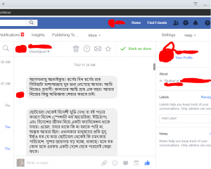

ছোটবেলা থেকেই বিদেশী মুভি দেখা বা বই পড়ার কারণে বিদেশ (স্পেশালি নর্থ আমেরিকা, ইউরোপ) এবং বিদেশের জীবন নিয়ে একটা ফ্যাসিনেশন থাকে সবার। ওয়েল, সবার থাকে কি না বলতে পারি না, অন্তত আমার ছিল। ওখানকার মানুষদের প্রতি মৃদু ইর্ষাও হত যে তারা ছোটবেলা থেকেই কি চমৎকার পরিবেশে, সুন্দর জায়গায় বড় হচ্ছে, থাকছে। মনে হত কোন মতে ওরকম একটা দেশে যেতে পারলেই কেল্লা ফতে। যতই সময় যাচ্ছে, আমি আল্লাহ্‌র প্রতি ততই কৃতজ্ঞ হচ্ছি যে উনি আমাকে চমৎকার একটি মুসলিম পরিবারে জন্ম নেওয়ার সৌভাগ্য দিয়েছেন। দিয়েছেন পরিবারের প্রতি সম্পূর্ন নিবেদিত একজন মা এবং স্ত্রী-সন্তানদের সযত্নে আগলে রাখা একজন বাবা।

.. . কানাডায় আমার প্রবাসের প্রায় এক বছর পার হতে চলল। এই এক বছরে এখানকার মানুষদের প্রতি আমার সেই ফ্যাসিনেশনটি করুণায় পরিণত হয়েছে। পড়াশোনা আর অ্যাকাডেমিক সুপারভাইজরের মানসিক যাঁতাকল নিয়ে গ্র্যাজুয়েট স্টুডেন্টদের কষ্টের কথা দেশের অনেকেই মোটামুটি শুনেন/জানেন বলে সেটা নিয়ে এখানে কথা বলবো না। তার চেয়ে বরং চেষ্টা করবো একটু ব্যাখ্যা করার কেন এখানের মানুষগুলো আমার চোখে ফ্যাসিনেশন থেকে করুণার পাত্রে পরিণত হল। তবে প্রথমেই বলে নেই যে এদের একদম সবকিছুই খারাপ না, কিছু কিছু জিনিস আমার ভাল লাগে। ওগুলোও বলবো। . .

.এখানে অনেক ধর্মের এবং অনেক ধরণের মানুষ আছে। আস্তিক, নাস্তিক, ট্রান্সজেন্ডার, হোমোসেক্সুয়াল সবই আছে প্রচুর পরিমাণে। ইহুদি অধ্যুষিত এলাকায় ইহুদি উপাসনালয়, স্কুল/কলেজ অনেক। আবার নগরের ভিতর জায়গায় জায়গায় খ্রিস্টানদের চার্চ আছে ভালই। “জেহোভার সাক্ষী” (Jehovah’s Witness) হল খ্রিস্টানদের ধর্মীয় দাওয়াত দেওয়ার একটি গ্রুপ। এরা সপ্তাহে একবার-দুইবার সবাই একসাথে বসে বিভিন্ন সোশাল অ্যাকটিভিটি করে (যেমন সবাই মিলে নতুন কোন ভাষা শেখা, বা শিক্ষামূলক ভিডিও দেখা) আর খ্রিস্ট ধর্মের গুণগান করে। মাঝে মাঝে নতুন কাউকে পেলে দাওয়াত দেয়। আমাকেও দুই-তিনবার ভদ্রভাবে দাওয়াত দিয়েছিল ওদের দুইজন। সাদা চামড়ার একজন মানুষ রাস্তায় হঠাত করে আমাকে দাঁড় করিয়ে মোটামুটি শুদ্ধ বাংলায় কথা বলে আমাকে দাওয়াত দিচ্ছে, বেশ অবাকই হয়েছিলাম। ঐ কাহিনীগুলো আরেকদিনের জন্য তোলা থাক। মসজিদও আছে মোটামুটি ভালই। বাংলাদেশ থেকে আসার পর যে জিনিসগুলো মিস করি, সেগুলোর একটা হল প্রতি ওয়াক্তে আযান শোনা। এখানের নিয়ম হল মসজিদে আযান হলে আযানের শব্দ শুধু মসজিদের ভিতরেই থাকবে, বাইরে যাবে না। তাই সাধারণত ঘড়িতে সময় দেখেই নামাজ পড়া লাগে, আযান শুনে নয় \[১\]।

আপাতদৃষ্টিতে এরা ধর্মনিরপেক্ষ। সরকার বড় গলায় তা-ই প্রচার করে। কিন্তু হর্তা-কর্তাদের নীতি নির্ধারণী দেখে বোঝা যাবে এরা আসলে অ্যান্টি-মুসলিম ছাড়া কিছুই না। কিছুদিন আগেই নিয়ম করা হয়েছে যে বাসে/ট্রেনে উঠতে হলে মুখ ঢেকে রাখা যাবে না। নিকাব করা যাবেনা। সরকারী কোন অফিসে চাকরি করতে হলে এমন কোন পোষাক পরা যাবে না যেটা দেখে তার ধর্ম বুঝা যায় (হিজাব, নিকাব, টুপি ইত্যাদি)। \[২,৩,৪\]

.সাধারণ মানুষদের কাছে ধর্ম বেশ সেনসিটিভ বিষয়। প্রফেশনাল ওয়ার্কপ্লেসে কেউ সাধারণত কারো ধর্ম নিয়ে কোন কথা বলে না। কোন মিটিং শেষে কোন নারী হ্যান্ডশেক করার জন্য হাত এগিয়ে দিলে ভদ্র ভাবে প্রত্যাখ্যান করে বলি যে আমি মুসলিম।. .

.যেহেতু এটা “উন্নত বিশ্ব”, তাই এখানে ট্রান্সজেন্ডার( Transgender বা Transexual এবং হিজড়া কিন্তু এক জিনিস নয়। হিজড়া মানে তো বুঝতেই পারছেন। Transgender বা Transexual হলো এমন একদল মানুষ যারা মনে করে তারা ভুল শরীরে আটকা পড়েছে। জন্মগতভাবে পুরুষ মনে করে যে, সে আসলে নারী কিন্তু পুরুষের শরীরে আটকা পরেছে। ঠিক একইভাবে জন্মগতভাবে নারী মনে করে যে সে আসলে পুরুষ, কিন্তু ভুলে নারীর শরীরে আটকা পড়েছে।-লস্টমডেস্টি), হোমোসেক্সুয়াল এবং হাজারো সেক্সুয়াল ওরিয়েন্টেশনের মানুষের সংখ্যা অসামান্য। রাস্তা ঘাটে অহরহ এরকম কাপল ঘুরে বেড়াতে দেখা যায়। বছরে একবার ঘটা করে LGBT প্রাইডের র‍্যালি হয়।যদিও এখন শুধু LGBTতেই সীমাবদ্ধ নেই, কিছুদিন পর পরই একটা-দুইটা করে লেটার বা সিম্বল যোগ হতে থাকে, দেখা যাবে আমার এই লেখা লিখতে লিখতে আরো লেটার যোগ হয়ে গেছে, তাই শুধু LGBTতেই রেখে দিলাম। (কানাডা হলো বিশ্বের চতুর্থতম দেশ যারা সমলিঙ্গের বিয়েকে বৈধ্যতা দিয়েছে। আমেরিকারও অনেক আগে। সমকামী বিয়ের বৈধতা দানকারী প্রথম তিনটি দেশ হল যথাক্রমে নেদারল্যান্ড,বেলজিয়াম এবং স্পেইন- লস্টমডেস্টি। \[৫,৬\])

.এবারে একটু অন্য প্রসঙ্গে যাই। কিভাবে একটা সমস্যা থেকে আরো সমস্যা তৈরী হয়, কিভাবে সমস্যা সমাধানের ভান করতে হয়, এগুলো একটু আলোচনা করা যাক। শীতকালে রাস্তা-ঘাটে চলাচল করে একটু শান্তি পাওয়া যায়। ঠান্ডা যত বেশি, তত ভাল। কেন? কারণ, পোশাক। গরমের সময় নারীকূলের পোশাকের অবস্থা এত বাজে থাকে যে রাস্তা-ঘাটে চলাচল করতে গেলে প্রায় পুরোটা সময়ই চোখ মাটির দিকে রাখা ছাড়া উপায় থাকে না। আচ্ছা পোশাকের কথা তো বললাম। এবার এর সাথে “একেবারেই সম্পর্কহীন” আরেকটি জিনিস বলি। যৌন হয়রানি। কেন জানি (!) এসব দেশে যৌন হয়রানি খুবই বেশি।  এবং এরা এই সমস্যা সমাধানের জন্য খুবই তৎপর (!)। সব অফিসেই বছরে অন্তত একবার যৌন হয়রানি রোধে সেমিনার হবে। আমি রিসার্চ ট্রেইনি হিসাবে একটি সংস্থায় যোগ দেওয়ার কয়েকদিন পর একটি বাধ্যতামূলক সেমিনারের ইনভাইটেশন পেলাম। বিশাল অডিটোরিয়ামে সব কর্মীদের নিয়ে যৌন হয়রানি প্রতিরোধমূলক এক সেমিনার। মূলত, কার সাথে কিভাবে কথা বলতে হবে, নারী সহকর্মীর সাথে খাজুরে আলাপের সময় কোন কোন কথা বলা যাবে আর কোন কোন কথা বলা যাবে না, স্পর্শ করা যাবে কি যাবে না, এসবই সবাইকে বলা হল ঘণ্টাখানেক ধরে।

.এদের একটা “যেমন খুশি তেমন সাজো” দিবস থাকে প্রতি বছর। আদর করে সেই দিবসকে হ্যালোউইন বলা হয়। হ্যালোউইনে নিজের স্বাধীনতার প্রকাশ ঘটাতে অনেকেই সর্বনিম্ন পরিমাণের কাপড় পরে রাস্তায় ঘোরাঘুরি করে। এই হ্যালোউইনের কয়েকদিন আগে থেকেই দেখলাম ক্যাম্পাসে বেশ কিছু পোস্টার যে হ্যালোউইনে মানুষ যেন যৌন হয়রানি থেকে সাবধান থাকে।

.এদের এই সব ঢং দেখে মনে হয় ব্যাপারটা এরকম- আমি জানি আগুনে হাত দিলে আমার হাত পুড়ে যাবে। আমি তাও আগুনে হাত দিব, কিন্তু চাইবো যে আমার হাত পুড়বে না, হাজার রকমের চেষ্টা করতে থাকবো হাত না পুড়ানোর, শুধু আগুন থেকে হাতটা টেনে বের করা ছাড়া। . কিছুদিন আগে একটা আর্টিকেল পড়লাম যে #metoo মুভমেন্টের কারণে এখন কর্মক্ষেত্রে পুরুষরা তাদের নারী সহকর্মীর সাথে একদম প্রয়োজন ছাড়া অযথা কোন সময় কাটাচ্ছেন না, একসাথে একান্তে লাঞ্চ বা ডিনার করা তো দূরের কথা (যা কি না খুবই প্রচলিত ছিল)। ঐ আর্টিকেলে নারী-পুরুষের এই দূরত্বকে নেতিবাচক জিনিস হিসাবে উল্লেখ করা হচ্ছিল, কিন্তু আমার বরং খুশিই লাগল।

(কানাডাতে নারী এবং শিশুদের ভয়ঙ্কর যৌন নিপীড়নের শিকার হতে হয়। প্রতি ৩ জন কানাডিয়ান নারীদের মধ্যে ১ জন যৌন নিপীড়নের শিকার হন। প্রতি ৬ জন পুরুষের মধ্যে ১ জন জীবনে কমপক্ষে একবার হলেও যৌন নিপীড়নের শিকার হন। ভয়ের ব্যাপার হলো শতকরা ৫ জন তাদের যৌন নিপীড়নের ব্যাপারে মুখ খোলেন। #metoo মুভমেন্টের পর অবশ্য রিপোর্ট করার সংখ্যা বেড়েছে। ৬৭ শতাংশ কানাডিয়ান জানাচ্ছেন তারা কমপক্ষে এমন একজন নারীকে চেনেন যাকে দৈহিক বা যৌন নির্যাতন করা হয়েছে। ধর্ষণের অন্যতম হাতিয়ার হিসেবে ব্যবহার করা হয় এলকোহল।\[ ৭,৮,৯\]

.২০১৪ সালের একটি জরিপ থেকে দেখা যাচ্ছে প্রায় ২৪ লক্ষ কানাডিয়ান শিশু যৌন নির্যাতনের শিকার হয়েছে। প্রকৃত সংখ্যা আরো বহুগুনে বেশি। আমরা আগেই বলেছি যে যৌন নিপীড়নের ব্যাপারে খুবই কম সংখ্যক কানাডিয়ান মুখ খোলেন। \[১০\]

Canadian Medical Association Journal বলছে এই সংখ্যা আরো বেশি। প্রায় ৩৬ লক্ষ। মানে হলো প্রতি ১০ জনে ১ জন ১৬ বছর বয়স হবার আগেই যৌন নিপীড়নের শিকার হয়। \[১১,১২\]

কানাডার কর্মক্ষেত্র-অফিস আদালত নারীদের জন্য স্রেফ দোযখ।

নব্বই শতাংশের কিছু বেশী কানাডিয়ান নারীরা বলেছেন তারা তাদের কর্মক্ষেত্রে অন্তত একবার কর্মক্ষেত্রে নির্যাতনের স্বীকার হয়েছেন । নব্বই শতাংশ পুরুষও স্বীকার করেছেন তারা অন্তত একটি কর্মক্ষেত্রে সংঘটিত যৌন নির্যাতনের কথা জানেন বা নিজে সাক্ষী ছিলেন । কর্মক্ষেত্রের এই যৌন হয়রানীই বোধহয় সেই প্রভাবকগুলোর একটা , যেগুলোর কারণে কানাডিয়ান নারীরা খুব ঘন ঘন চাকুরী পরিবর্তন করেন। \[১৩\]

Human Resources Professionals Association এর জরিপে উঠে এসেছে যে প্রতি তিন জনে একজন কানাডিয়ান নারী কর্মক্ষেত্রে যৌন নিপীড়নের শিকার হন। পুরুষরাও খুব বেশি পিছিয়ে নেই। প্রতি ১০০ জন পুরুষের ভেতর ১২ জন কর্মক্ষেতের যৌন নির্যাতনের শিকার হন। এই রিপোর্টেও উঠে এসেছে ৮০ শতাংশ ক্ষেত্রে যৌন নিপীড়নের ঘটনার রিপোর্ট করা হয়না। বলাই বাহুল্য #metoo মুভমেন্টের পর এই ঘটনাগুলো প্রকাশ্যে আসছে।– লস্টমডেস্টি। \[১৪,১৫,১৬\] )

.এখানের মানুষ খুবই আত্মকেন্দ্রিক এবং ক্যারিয়ার-ওরিয়েন্টেড। ছেলে-মেয়ে আঠারো-বিশ বছর বয়স হলেই বাবা-মা আশা করে ছেলে-মেয়েরা আলাদা হয়ে যাবে তাদের থেকে। সারা জীবন আত্মকেন্দ্রিক থাকার কারণে বুড়ো বয়সে গিয়ে দেখা যায় এরা একদম একা হয়ে গিয়েছে। হয় ওল্ড হোমে গিয়ে দিন কাটাতে হয়, অথবা নিজের বাড়িতেই প্রায় নিঃসঙ্গ ভাবে শেষ দিন গুলো পার করতে হয়। নিঃসন্তান এক বৃদ্ধাকে চিনি, যার বাবা-মা, স্বামী কেউ বেঁচে নেই, নেই কোন আত্মীয়-স্বজন। তার দিন কাটে একলা অ্যাপার্টমেন্টে। তার নিঃসঙ্গতার কথা চিন্তা করলে দম আটকে আসে আমার।

( প্রতি ৩ জন কানাডিয়ানদের ১ জন ভয়াবহ মানসিক স্বাস্থ্যঝুঁকির সম্মুখীন।কিশোর কিশোরী তরুণ তরুণীদের মানসিক স্বাস্থ্যের অবস্থা ভয়াবহ। ছোট্ট বয়সটাতেই হতাশা,অবসাদ, ক্লেদ জাঁকিয়ে বসেছে এমন  কিশোর কিশোরী তরুণ, তরুণীর সংখ্যা  হুহু করে বাড়ছে। প্রতি পাঁচজনের একজন মনোযাতনায় ভুগছে। এদের সামনে লম্বা একটা সময় পড়ে আছে, জীবনতো শুরুই হয়নি কিন্তু এরই মধ্যে তাদের পৃথিবী  এতোটাই সঙ্কীর্ণ হয়ে পড়েছে যে অনেকে  আত্মহত্যা করে  পালিয়ে বাঁচতে চাইছে। এই বয়সের কানাডিয়ানদের মৃত্যুবরণের দ্বিতীয় শীর্ষ কারণ হল আত্মহত্যা।

ম্যাকমাস্টার ইউনিভার্সিটির শিশু মনোরোগ বিশেষজ্ঞ [Dr. Jean Clinton](https://globalnews.ca/news/530141/young-minds-stress-anxiety-plaguing-canadian-youth/Dr.%20Jean%20Clinton) সতর্ক সঙ্কেত জানিয়ে বলছেন, তরুণ তরুণীদের মধ্যে ক্রমবর্ধমান মানসিক সমস্যা বেড়ে যাওয়ায় আমরা খুবই উদ্বিগ্ন। অবশ্যই বলতে হবে আমাদের সমাজ  এক মহাসঙ্কটের ভেতর পড়েছে’।–লস্টমডেস্টি \[১৭,১৮,১৯\]। )

.যেহেতু ধর্মীয় বিধি-নিষেধ নেই, তাই এদের কাছে প্রেম-ভালোবাসার সংজ্ঞাও ভিন্ন। সম্ভাব্য পার্টনারের সাথে প্রথমেই শারীরিক সম্পর্ক করে, তারপর চিন্তা করে দেখে ভালো বাসা যাবে কি না, সম্পর্ক চালালে ক্যারিয়ারের ক্ষতি হবে কি না। ক্যারিয়ার এবং স্বার্থ প্রাধান্য পায় বলে সম্পর্কগুলোও হয় ঠুনকো, ভাংতে সময় লাগে না। . রিসার্চের কাজে আমাকে কয়েক জায়গায় কাজ করার দরকার হয়েছে। এক জায়গার অভিজ্ঞতা বলি। ওখানে আমার সাথে আরো ৩-৪ জন ছেলে কাজ করতো। আমি ওখানে নতুন, আর ঐ ছেলেগুলোকে বেশ ফ্রেন্ডলি মনে হত বলে ভাবতাম এদের সাথে ভাব জমাতে পারলে ভালই হবে। কাজের ফাঁকে ওরা গল্প করতো নিজেরা নিজেরা। একদিন শুনি যে একজন আরেকজনকে এক মেয়ের ব্যাপারে বলছে। মেয়েটার নাম মনে নাই, ধরে নিই লুসি। তো শুনলাম ছেলেটা বলছে, “আরে আমি লুসিকে কোনভাবেই বুঝাতে পারছি না যে ও আমার গার্লফ্রেন্ড না। ও মনে করছে আমরা কাপল। অথচ আমরা কাপল না! মাত্র দুইবার একসাথে রাত কাটিয়েছি আমরা! আর ও কি না মনে করছে আমি ওর বয়ফ্রেন্ড হয়ে গেছি।”

.বলা বাহুল্য, ছেলেটার ভাষা এতটা ভদ্র ছিল না। এই আলাপ শোনার পর ঐ ছেলেগুলোর সাথে আমার খাতির জমানোর শখ ঐ মুহুর্তেই উবে গেছে। . .

.মানুষ সব সময় একটা গোল বা লক্ষ্য মাথায় রেখে আগাতে থাকে। আপনি যখন স্কুলে পড়ছেন, তখন আপনার লক্ষ্য থাকে যে সামনের পরীক্ষাতে ভাল করা, এবং সামনের পরীক্ষাগুলোতে ভাল করলে ভাল একটা কলেজে চান্স পাবেন। একইভাবে কলেজ, ইউনিভার্সিটি, চাকরি, প্রমোশন, বিয়ে, সন্তান, আরো প্রমোশন। কিন্তু তারপর? আল্টিমেট গোল বা চূড়ান্ত লক্ষ্য কী? আস্তিক আর নাস্তিকের মধ্যে তফাৎটা এখানেই। আস্তিকের পরকালে বিশ্বাস আছে বলে তার অন্য সব লক্ষ্য অর্জন হলেও পরকালের লক্ষ্যটি মাথায় থাকে ঠিকই। কিন্তু নাস্তিক হওয়ার সাইড-ইফেক্টগুলোর একটি হল, কোন চূড়ান্ত লক্ষ্য না থাকা। চাকরি, প্রমোশন ইত্যাদি চলতে চলতে জীবনকে এক পর্যায়ে স্থির মনে হতে থাকে। লক্ষ্যহীন হয়ে পড়ে মানুষ তখন ভাল থাকতে পারে না। যেহেতু “আধুনিক” মানুষ মাত্রই নাস্তিক, তাই এদিকের মানুষের ডিপ্রেশন, মানসিক সমস্যা অত্যন্ত বেশি। আর এই ডিপ্রেশন চরমে পৌঁছে গেলে আত্মহত্যাও করে ফেলে। .

আত্মকেন্দ্রিক হওয়ার কারণে এরা খুবই বিচ্ছিন্ন থাকে একে অপরের থেকে। এর খারাপ দিক আছে, ভাল দিকও আছে। খারাপ দিক হল, এর ফলে ওরা কেমন জানি যান্ত্রিক হয়ে পড়ে এবং নানাবিধ মানসিক সমস্যায় বেশি ভুগে। ভাল দিক হল, কেউ কারো বিষয়ে নাক গলায় না। মানুষে কে কী ভাবলো, তা নিয়েও বেশি চিন্তা করে না। .

.এখানের মানুষদের আরো কিছু ভাল দিক হল তারা সাধারণত বেশ হেল্পফুল। সাহায্য চাইলে যথাসাধ্য সাহায্য করবে, আচার-ব্যবহারে খুবই অমায়িক (বেশির ভাগ সময়েই)। রেসিজম যে একেবারে নাই, তা না, সামান্য পরিমাণে হলেও আছে। কথা-বার্তা বললে সোজা-সাপ্টা কথাই বলে। আমি এখানে আসার পর একজন কানাডিয়ানের সাথে কথা বলতে গেলে যতটা সতর্ক থাকি, তার চেয়ে হাজারগুণে বেশি সতর্ক থাকি কোন বাংলাদেশীর সাথে কথা বলতে গেলে। ব্যাপারটা দুঃখজনক হলেও সত্যি।

. . এখানের ট্রান্সজেন্ডার, হোমোসেক্সুয়ালদের অভয়ারণ্য, ধর্মনিরপেক্ষতার নামে মুসলিম-বিদ্বেষ দেখে গা জ্বালা করে। লক্ষ্যহীন আত্মকেন্দ্রিক নিঃসঙ্গ মানুষগুলোকে দেখে করুণা হয়। বাংলাদেশ অন্য সব দিক দিয়ে একদম পচে গেলেও পারিবারিক বন্ধন আর মানসিক স্বাস্থ্যের দিক দিয়ে এসব “উন্নত বিশ্বের” চেয়ে ঢের এগিয়ে। .

এখানে অনেক কিছু দেখে-শুনে আরো একটা উপলব্ধি হয়েছে। মুসলিম ঘরে জন্মে, মুসলিম হয়ে থাকতে পারাও আল্লাহ্‌র পক্ষ অনেক বড় নিয়ামত। . . . “অতঃপর তোমরা তোমাদের রবের আর কোন কোন অনুগ্রহকে অস্বীকার করবে?” \[আল ক্বুরআন ৫৫:১৩\]

চলবে ইনশা আল্লাহ...

পড়ুন আগের পর্বগুলোঃ

[স্বর্গের দিন স্বর্গের রাত (প্রথম পর্ব)](https://cms.lostmodesty.com/2018/11/%E0%A6%B8%E0%A7%8D%E0%A6%AC%E0%A6%B0%E0%A7%8D%E0%A6%97%E0%A7%87%E0%A6%B0-%E0%A6%A6%E0%A6%BF%E0%A6%A8-%E0%A6%B8%E0%A7%8D%E0%A6%AC%E0%A6%B0%E0%A7%8D%E0%A6%97%E0%A7%87%E0%A6%B0-%E0%A6%B0/)

[স্বর্গের দিন স্বর্গের রাত (দ্বিতীয় পর্ব)](https://cms.lostmodesty.com/2018/11/%E0%A6%B8%E0%A7%8D%E0%A6%AC%E0%A6%B0%E0%A7%8D%E0%A6%97%E0%A7%87%E0%A6%B0-%E0%A6%A6%E0%A6%BF%E0%A6%A8-%E0%A6%B8%E0%A7%8D%E0%A6%AC%E0%A6%B0%E0%A7%8D%E0%A6%97%E0%A7%87%E0%A6%B0-%E0%A6%B0%E0%A6%BE/)

আরো পড়ুনঃ

[মুখোশ উন্মোচনঃ প্রথম পর্ব](https://cms.lostmodesty.com/2018/09/%E0%A6%AE%E0%A7%81%E0%A6%96%E0%A7%8B%E0%A6%B6-%E0%A6%89%E0%A6%A8%E0%A7%8D%E0%A6%AE%E0%A7%8B%E0%A6%9A%E0%A6%A8%E0%A6%83-%E0%A6%AA%E0%A6%B0%E0%A7%8D%E0%A6%AC-%E0%A7%A7/)

[মুখোশ উন্মোচনঃ তৃতীয় পর্ব](https://cms.lostmodesty.com/2018/08/%E0%A6%AE%E0%A7%81%E0%A6%96%E0%A7%8B%E0%A6%B6-%E0%A6%89%E0%A6%A8%E0%A7%8D%E0%A6%AE%E0%A7%8B%E0%A6%9A%E0%A6%A8%E0%A6%83-%E0%A6%AA%E0%A6%B0%E0%A7%8D%E0%A6%AC-%E0%A6%A4%E0%A6%BF%E0%A6%A8-%E0%A6%AA/)

[নরক -](https://cms.lostmodesty.com/2018/08/%E0%A6%A8%E0%A6%B0%E0%A6%95/)

 

.

লেখকঃ নাম প্রকাশে অনিচ্ছুক। লেখক, কানাডার  কিউবেকে  অধ্যয়নরত।.

রেফারেন্সঃ

\[১\] Loudspeakers in mosques- [https://tinyurl.com/adjew8d](https://tinyurl.com/adjew8d)

\[২\] Quebec bans niqab for public services with neutrality law- [https://tinyurl.com/yd8swe7r](https://tinyurl.com/yd8swe7r)

\[৩\] Quebec bans Muslim women from wearing face veils on public transport-   [https://tinyurl.com/ybk6bpow](https://tinyurl.com/ybk6bpow)

\[৪\] Quebec passes bill banning niqab, burka while receiving public services-[https://tinyurl.com/y8b8s39u](https://tinyurl.com/y8b8s39u)

\[৫\] Same-Sex Marriage in Canada- [https://tinyurl.com/y9nr336q](https://tinyurl.com/y9nr336q)

\[৬\] TIMELINE | Same-sex rights in Canada-[https://tinyurl.com/yaxq5rwt](https://tinyurl.com/yaxq5rwt)

\[৭\] Understanding the prevalence of sexual assault in our community is important, here are some statistics to understand the nature of sexual violence [https://tinyurl.com/ycxgj5xd](https://tinyurl.com/ycxgj5xd)

\[৮\] One in seven sexual assault cases in 2017 deemed 'unfounded': StatsCan [https://tinyurl.com/ybjtdl4x](https://tinyurl.com/ybjtdl4x)

\[৯\] Police-reported sexual assaults in Canada before and after #MeToo, 2016 and 2017 [https://tinyurl.com/yd8kqlbu](https://tinyurl.com/yd8kqlbu)

\[১০\] Burczycka, M. and S. Conroy. 2017. “Family Violence in Canada: A Statistical Profile, 2015.” Juristat, Vol. 37, No. 1. Ottawa: Statistics Canada. Cat. No. 85-002-X.

\[১১\] Afifi, T., MacMillan, H., Boyle, M., Taillieu, T., Cheung, K., and J. Sareen. 2014. “Child Abuse and Mental Disorders in Canada,” Canadian Medical Association Journal, vol. 186, no. 9, pp. 1-9.

\[১২\] CHILD SEXUAL ABUSE BY K-12 SCHOOL PERSONNEL IN CANADA EXECUTIVE SUMMARY [https://tinyurl.com/yalakf3z](https://tinyurl.com/yalakf3z)

\[১৩\] Sexual Harassment in the Workplace- [http://tinyurl.com/ctvwqem](http://tinyurl.com/ctvwqem)

\[১৪\] Workplace Sexual Harassment An 'Epidemic' In Canada: Report- [https://tinyurl.com/y9meee8g](https://tinyurl.com/y9meee8g)

\[১৫\] Workplace Sexual Harassment Poll: Most People Don't Report Incidents [https://tinyurl.com/ycryje2m](https://tinyurl.com/ycryje2m)

\[১৬\] More than half of adult women in Canada have experienced 'unwanted sexual pressure,' online survey suggests- [https://tinyurl.com/ycj7dd6r](https://tinyurl.com/ycj7dd6r)

\[১৭\] Young Minds: Stress, anxiety plaguing Canadian youth- [https://tinyurl.com/ycps7wur](https://tinyurl.com/ycps7wur)

\[১৮\] Why more Canadian millennials than ever are at ‘high risk’ of mental health issues [https://tinyurl.com/ya6uc68p](https://tinyurl.com/ya6uc68p)

\[১৯\] One-third of Canadians at ‘high risk’ for mental health concerns: poll [https://tinyurl.com/yazjssqw](https://tinyurl.com/yazjssqw)
